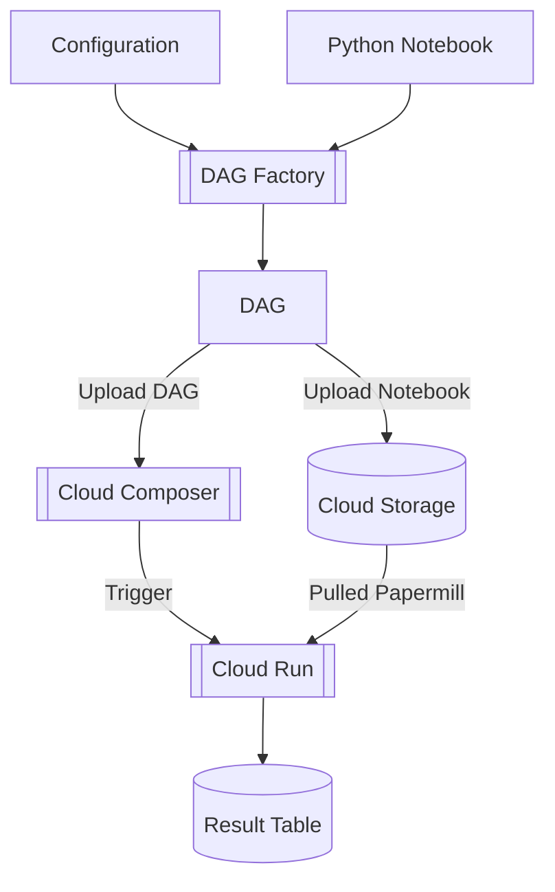

# mini-orchestrator
A combination of my multiple articles about Apache Airflow and Google Cloud Platform  
**Reference** :
 - Airflow DAG Factory : [Medium](https://medium.com/@chanon.krittapholchai/apache-airflow-dynamic-dag-with-jinja-ffc1c90910bf)
 - Airflow with Idempotent RUN_DT : [Medium](https://medium.com/@chanon.krittapholchai/apache-airflow-useful-practices-idempotent-dag-6d52b1594704)
 - Notebook job with Papermill on Cloud Run : [Medium](https://medium.com/@chanon.krittapholchai/serverless-notebook-job-with-papermill-and-google-cloud-run-job-8c48c8b5482a)
 - Upsert BigQuery with Python : [Medium](https://medium.com/@chanon.krittapholchai/upsert-bigquerys-partition-from-pandas-dataframe-ad1437cb1d3d)

# Concept

# To Run
## Option 1 : Notebook dry run
1. Rename or copy `env_template` into `.env`
    - [P1](pipelines/pipeline1/env_template)
    - [P2](pipelines/pipeline2/env_template)
2. Config environment parameters
3. Run the notebook from top cell
    - [P1](pipelines/pipeline1/p1.ipynb)
    - [P2](pipelines/pipeline2/p2.ipynb)

*Requirements and documentation were already provided in the notebook

## Option 2 : With Apache Airflow and Cloud Run
### Deploy Cloud Run with Papermill
1. Open Cloud Run notebook [HERE](cloud_run/create_cloud_run.ipynb)
2. Set up parameters
3. Run cell by cell
4. Upload notebooks to target GCS

### Run Mini Dag Factory
1. Config parameters in config files
    - [P1](pipelines/pipeline1/config.yaml)
    - [P2](pipelines/pipeline2/config.yaml)
2. Run this command to trigger mini dag factory : `python mini_factory_run.py`

### Apache Airflow
1. Run this command to change to Airflow's directory : `cd airflow`
2. Run this command to start Airflow's containers `docker compose up -d`
3. Open `http:localhost:8080`, log in with `airflow` and `airflow`

*Or just use existing GCC