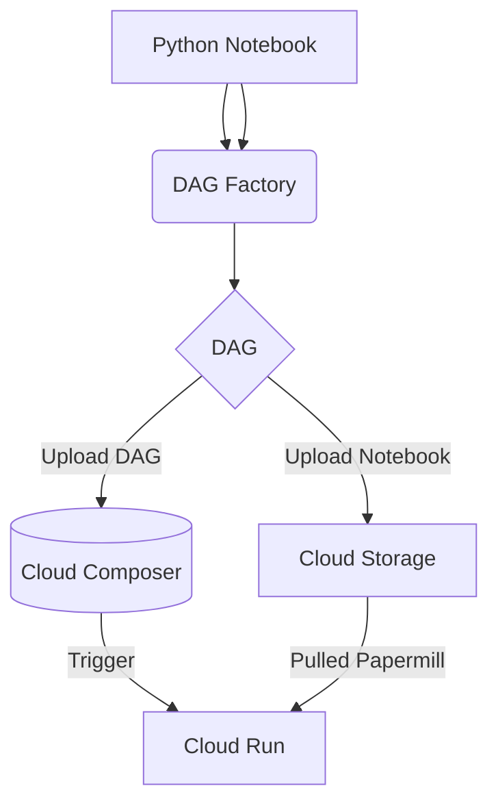

# mini-orchestrator
A combination of my multiple articles about Apache Airflow and Google Cloud Platform

# Concept

```mermaid
flowchart TD
    A[Configuration] --> B(DAG Factory)
    A[Python Notebook] --> B
    B --> C{DAG}
    C -- Upload DAG --> D[(Cloud Composer)]
    C -- Upload Notebook --> E[Cloud Storage]
    D -- Trigger --> F[Cloud Run]
    E -- Pulled Papermill --> F
```
